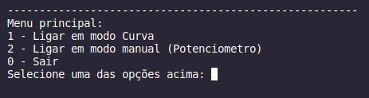
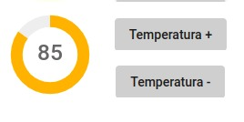
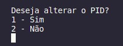
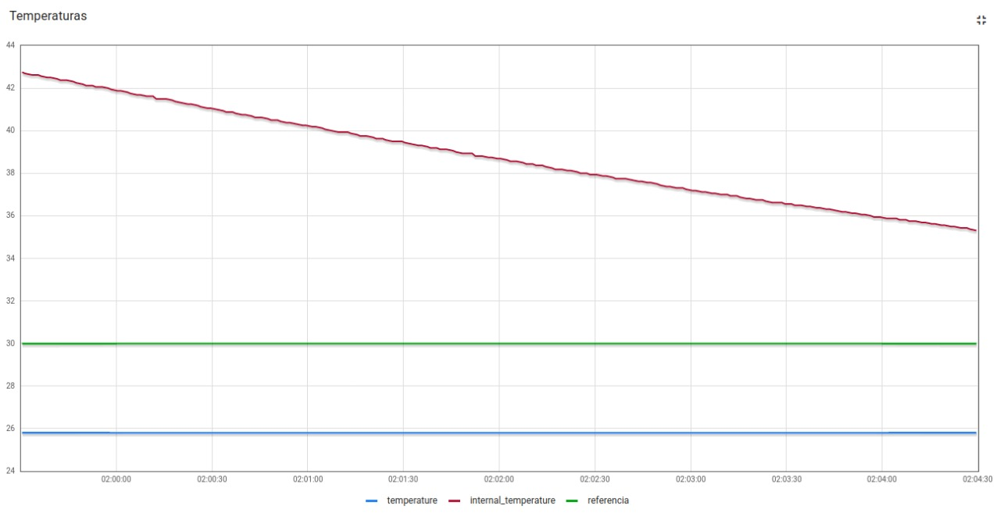

# Trabalho 2 - Fundamentos de Sistemas Embarcados

O presente projeto possui como finalidade a criação de um sistema que simula o funcionamento de um forno. Segue o link para acesso ao enunciado completo do projeto da disciplina: [trabalho 2 ](https://gitlab.com/fse_fga/trabalhos-2022_2/trabalho-2-2022-2)  


## Dados do Aluno

| Nome                          | Matrícula  |
| ----------------------------- | ---------- |
| Lorrany Oliveira Souza        | 18/0113992 |

## Como Executar

Antes de tudo, realize o clone deste repositório:

```bash
$ git clone https://github.com/lorranyoliveira/Tb_2_FSE.git
```
Em seguida execute:
```bash
$ make
```
Por último execute:
```bash
$ make run
```

Ao rodar o comando acima, você irá ver no terminal o menu abaixo:




A opção 1 é para ligar o forno em modo curva, ou seja, ele irá ler a temperatura de referencia e o tempo, por meio do arquivo curva_reflow.csv, disponibilizado pelo professor.

A opção 2 é para ligar no modo manual, ou seja, você controla a temperatura por meio do potenciomentro presente no dashboard: 



Ao escolher a opção que você deseja no menu principal, irá aparecer uma pergunta:



Se você selecionar que quer alterar, ele irá pedir para você digitar os valores das constantes.

Após isso, você irá ver o funcionamento no dashboard.

#### 1. Exemplo de funcionamento no dashboard com o modo de potenciometro




Além de aparecer o funcionamento no dash, observe que no terminal da aplicação, ele também printa o valor da temperatura ambiente, interna e de referência.

```bash
NOTE: Observe que ao iniciar o projeto, um arquivo log.csv será criado e ele irá armazenar as temperaturas e a data e horário que foram solicitadas.
```
## Vídeo da apresentação

[Apresentação no youtube do projeto 2 da disciplina FSE](https://www.youtube.com/watch?v=JSMDCc6GAqM)